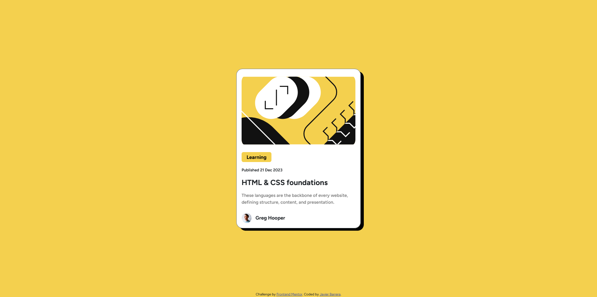

# Frontend Mentor - Blog preview card solution

This is a solution to the [Blog preview card challenge on Frontend Mentor](https://www.frontendmentor.io/challenges/blog-preview-card-ckPaj01IcS). Frontend Mentor challenges help you improve your coding skills by building realistic projects. 

## Table of contents

- [Overview](#overview)
  - [The challenge](#the-challenge)
  - [Screenshot](#screenshot)
  - [Links](#links)
- [My process](#my-process)
  - [Built with](#built-with)
  - [What I learned](#what-i-learned)
  - [Useful resources](#useful-resources)
- [Author](#author)

## Overview

### The challenge

Users should be able to:

- See hover and focus states for all interactive elements on the page

### Screenshot



### Links

- Solution URL: [https://github.com/javierb256/Blog-Preview-Card](https://github.com/javierb256/Blog-Preview-Card)
- Live Site URL: [https://javierb256.github.io/Blog-Preview-Card/](https://javierb256.github.io/Blog-Preview-Card/)

## My process

### Built with

- Semantic HTML5 markup
- CSS custom properties
- Mobile-first workflow
- [Bootstrap](https://getbootstrap.com/) 

### What I learned
I used the Bootstrap framework to complete this challenge. I utilized the card class as it closely resembles the card that we are challenged to create. For the structure I divided the card into two sections. The top for the image and the bottom for the content. I made sure that the page was responsive on different viewports.

I used the bootstrap card class

```html
<div class="card border-secondary mx-4 pt-3">
     
</div>
```
I added an image to the top using the card-img-top class

```html

```

For the rest of the content I put it within a card body
```html
<div class="card-body">

</div>
```

### Useful resources

- [Boostrap Card documentation](https://getbootstrap.com/docs/5.3/components/card/) - This helped me see how cards are made within bootstrap as well as the various classes you could use with it.

## Author

- Website - [https://javierbarrera.dev/](https://javierbarrera.dev/)
- Frontend Mentor - [@javierb256](https://www.frontendmentor.io/profile/javierb256)
